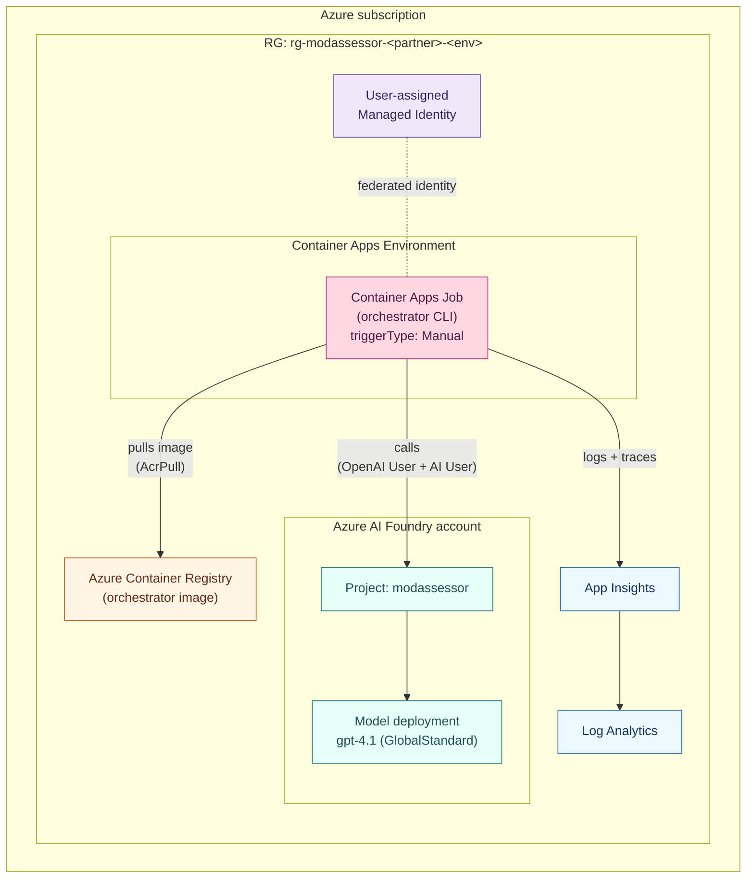
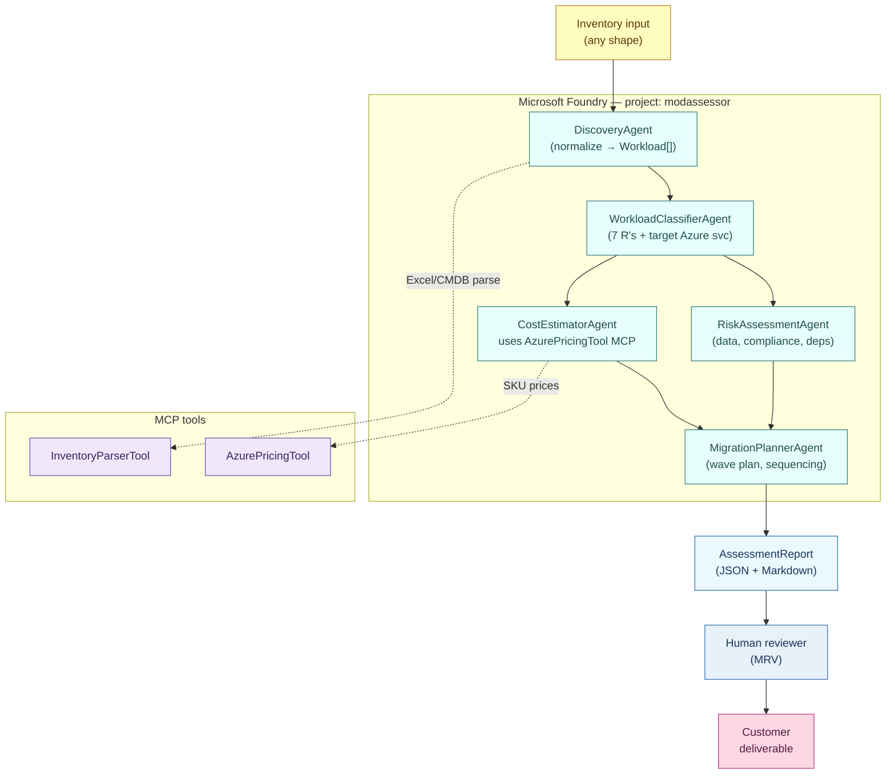
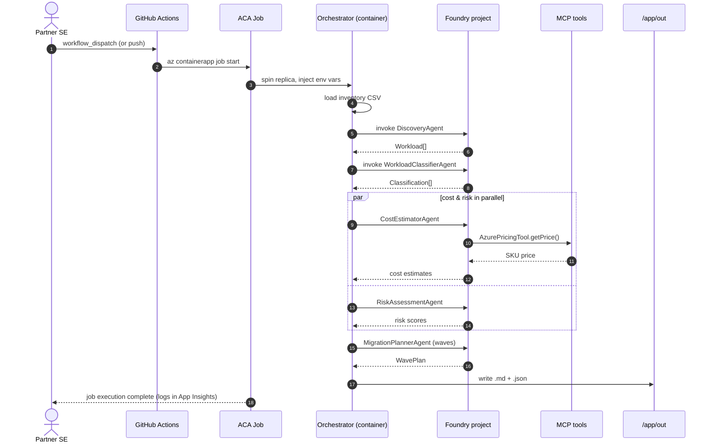

# Modernization Assessor

> A partner-reusable, multi-agent AI system that turns a customer's raw IT estate inventory into a draft Azure modernization assessment — workload classification, target services, rationale, prerequisites, risks — in **hours instead of weeks**.

Built with **Microsoft Agent Framework (MAF)** + **Azure AI Foundry**. C# / .NET 9. Designed from day one to be cloned and resold by Microsoft partners.

[](https://github.com/fabio-padua/modernization-assessor/actions/workflows/build.yml)


---

## Table of contents

1. [Why this exists](#why-this-exists)
2. [What it does](#what-it-does)
3. [Architecture](#architecture)
   - [End-to-end flow](#end-to-end-flow)
   - [What lives in Azure](#what-lives-in-azure)
   - [Inside the orchestrator](#inside-the-orchestrator)
   - [Agent choreography (v0.2 target)](#agent-choreography-v02-target)
   - [Single-run sequence](#single-run-sequence)
   - [Why each piece](#why-each-piece)
4. [The 7 R's classification model](#the-7-rs-classification-model)
5. [Repository layout](#repository-layout)
6. [Quickstart](#quickstart)
7. [Deployment](#deployment)
8. [Partner-reusable design principles](#partner-reusable-design-principles)
9. [Roadmap](#roadmap)
10. [Comparison to existing tooling](#comparison-to-existing-tooling)
11. [Responsible AI & human-in-the-loop](#responsible-ai--human-in-the-loop)
12. [License](#license)

---

## Why this exists

A typical Azure modernization assessment today takes **2–3 architects 2 weeks** of interviews, Azure Migrate exports, spreadsheet wrangling, and PowerPoint crafting. Output is inconsistent across engagements and rarely reusable. Partners that want to sell *fixed-price* modernization assessments can't, because their cost basis is unpredictable.

The opportunity is not "an AI that replaces the architect." It's **an AI that gives the architect a strong, well-reasoned first draft** — so the architect spends their time validating, customizing, and selling, not parsing CSVs.

This repository is the reference implementation of that idea, packaged so any Microsoft partner can clone it, plug in their own templates and pricing models, and ship.

## What it does

**Input:** a customer IT estate inventory — Azure Migrate CSV, ServiceNow CMDB export, Excel workbook, or partner-specific format.

**Output:** a draft assessment deliverable containing:

1. A canonical, normalized inventory (deduped, fields completed where possible)
2. Per-workload modernization strategy (one of the **7 R's**) with target Azure service, rationale, prerequisites, and risks
3. *(v0.2)* A 3-year TCO model based on live Azure Retail Pricing
4. *(v0.2)* A wave-based migration roadmap with dependency awareness
5. *(v0.2)* A risk register anchored to the Azure Well-Architected Framework

**Format:** structured JSON for downstream tooling + a human-readable Markdown summary. Word and PowerPoint generation is on the roadmap once the underlying analysis is solid.

## Architecture

Five views, from outermost to innermost: how a partner triggers a run, what gets provisioned in Azure, what the orchestrator does today, what the agent choreography will look like in v0.2, and what happens during a single run.

### End-to-end flow

From partner laptop to customer-ready report. v0.1 ends at step 5; v0.2 (deployment pipeline already scaffolded) automates 1–4.

```mermaid
flowchart LR
    P["Partner SE<br/>(laptop)"]:::human
    REPO["GitHub repo<br/>fabio-padua/modernization-assessor"]:::repo
    GHA["GitHub Actions<br/>deploy.yml"]:::ci
    AZ["Azure subscription"]:::cloud
    OUT["assessment-*.md<br/>+ .json"]:::artifact
    REV["Human reviewer<br/>(MRV gate)"]:::human
    CUST["Customer<br/>deliverable"]:::deliverable

    P -- "1. push code /<br/>workflow_dispatch" --> REPO
    REPO --> GHA
    GHA -- "2. provision Bicep" --> AZ
    GHA -- "3. build & push image" --> AZ
    GHA -- "4. update + start ACA Job" --> AZ
    AZ -- "5. orchestrator runs" --> OUT
    OUT -- "6. review & edit" --> REV
    REV -- "7. sign-off" --> CUST

    classDef human fill:#E8F1FA,stroke:#2B6CB0,color:#1A365D
    classDef repo fill:#F0E8FA,stroke:#6B46C1,color:#322659
    classDef ci fill:#FFF5E5,stroke:#C05621,color:#652B19
    classDef cloud fill:#E6FFFA,stroke:#2C7A7B,color:#234E52
    classDef artifact fill:#FEFCBF,stroke:#B7791F,color:#5F370E
    classDef deliverable fill:#FED7E2,stroke:#B83280,color:#521B41
```



### What lives in Azure

The deployment pipeline provisions one resource group per partner+environment. All v0.2 components are there; v0.3 will add AI Search, Cosmos DB, APIM, and Key Vault.



### Inside the orchestrator

Today (v0.1) the pipeline is deterministic C#. Each stage is the structural placeholder for the corresponding Foundry agent landing in v0.2.

```mermaid
flowchart LR
    CSV["inventory CSV<br/>(Azure Migrate / CMDB)"]:::input
    NORM["DiscoveryStage<br/>(CsvHelper)"]:::stage
    WL["Workload[]<br/>(canonical JSON)"]:::data
    CLS["ClassifierStage<br/>(7 R's rules)"]:::stage
    CL["Classification[]"]:::data
    MD["MarkdownRenderer"]:::stage
    REP["assessment-*.md<br/>assessment-*.json"]:::output

    CSV --> NORM --> WL --> CLS --> CL --> MD --> REP

    classDef input fill:#FEFCBF,stroke:#B7791F,color:#5F370E
    classDef stage fill:#E6FFFA,stroke:#2C7A7B,color:#234E52
    classDef data fill:#EBF8FF,stroke:#2B6CB0,color:#1A365D
    classDef output fill:#FED7E2,stroke:#B83280,color:#521B41
```



### Agent choreography (v0.2 target)

Each folder under [`src/Agents/`](src/Agents/) becomes a real Foundry agent. The orchestrator becomes a coordinator that calls them sequentially with one fan-out for cost + risk.



### Single-run sequence

What happens between `az containerapp job start` and a finished report.



### Why each piece

- **Foundry Agent Service** holds the *declarative* specialists — system prompt, knowledge sources, tools, and model are all config. A partner can clone an agent, edit its prompt or swap the model, and redeploy without touching orchestrator code.
- **Microsoft Agent Framework (MAF)** holds the *code-first* orchestration — intent routing, fan-out/fan-in across specialists, durable workflow with checkpointing, deterministic post-processing. MAF unifies Semantic Kernel + AutoGen; we use it directly.
- **MCP tool servers** are the **partner extension point**. To integrate a partner's pricing engine, ServiceNow tenant, GitHub Enterprise org, or proprietary migration factory templates, the partner writes (or forks) an MCP server. They never touch the orchestrator codebase.
- **APIM as AI Gateway** gives per-partner token caps, content safety enforcement, jailbreak detection, and *per-customer* cost attribution. This is what makes the product resellable rather than a demo.
- **AI Search** provides retrieval over the Well-Architected Framework, Azure Migrate guidance, and a partner's own past assessments / playbooks.
- **Cosmos DB** stores thread state, intermediate agent outputs, and human-review annotations. Per-partner containers isolate data.
- **App Insights** captures distributed traces with partner / agent / tool / cost dimensions — feeds the observability workbook shipped with the template.

## The 7 R's classification model

Every workload is classified into exactly one of seven strategies:

| Strategy | When to use | Typical Azure target |
|---|---|---|
| **Rehost** | Healthy workload, no immediate refactor need | Azure VM |
| **Replatform** | Container-friendly, gain managed runtime with minimal change | Azure Container Apps, App Service |
| **Refactor** | DB engine swap, PaaS adoption with code changes | Azure SQL MI, Azure DB for PostgreSQL |
| **Rebuild** | Cloud-native rewrite worth the investment | Functions, Logic Apps, ACA |
| **Replace** | SaaS equivalent already exists | Microsoft 365, Dynamics 365 |
| **Retire** | Decommission — no business value | (none) |
| **Retain** | Keep on-prem (regulatory, mainframe, sovereignty) | (none / Azure Arc for governance) |

The Workload Classifier agent must output a rationale for every choice, anchored to attributes present in the input. Hallucinated rationales are caught by the `groundedness` evaluator in the eval harness.

## Repository layout

```
modernization-assessor/
├─ README.md                    # this file
├─ LICENSE                      # MIT
├─ ModernizationAssessor.sln
│
├─ src/
│  ├─ Orchestrator/             # MAF host (CLI in v0.1, HTTP in v0.2)
│  │  ├─ Program.cs
│  │  ├─ Pipeline/              # Discovery + Classifier stages
│  │  └─ appsettings.json
│  ├─ Agents/                   # Foundry agent definitions (one folder each)
│  │  ├─ DiscoveryAgent/                  agent.md
│  │  ├─ WorkloadClassifierAgent/         agent.md
│  │  ├─ CostEstimatorAgent/              (v0.2)
│  │  ├─ MigrationPlannerAgent/           (v0.2)
│  │  └─ RiskAssessmentAgent/             (v0.2)
│  ├─ McpTools/                 # Partner-pluggable MCP servers
│  │  ├─ AzurePricingTool/                (v0.2)
│  │  └─ InventoryParserTool/             (v0.2)
│  └─ Shared/Models/            # Workload, Classification, AssessmentReport
│
├─ tests/Orchestrator.Tests/    # xUnit
├─ infra/                       # Bicep — subscription-scope deployment
│  └─ main.bicep
├─ .foundry/                    # Foundry skill workspace
│  ├─ agent-metadata.yaml       # canonical env + agent config
│  ├─ datasets/                 # golden eval datasets (gitignored content)
│  ├─ evaluators/               # evaluator definitions
│  └─ results/                  # eval results (gitignored content)
├─ samples/inventory/           # synthetic customer inventories
├─ docs/architecture/           # v0.1-scope.md, design notes
└─ .github/workflows/           # CI: build + test + smoke run
```

## Quickstart

### Prerequisites

- .NET 9 SDK ([download](https://dotnet.microsoft.com/download))
- Azure CLI (optional for v0.1; required for v0.2 `azd up`)
- Azure Developer CLI ≥ 1.25 (required for v0.2)
- Docker Desktop (required for v0.2 MCP servers)

### v0.1 — run the thin slice locally

```pwsh
git clone https://github.com/fabio-padua/modernization-assessor.git
cd modernization-assessor

dotnet build
dotnet test

dotnet run --project src/Orchestrator -- `
  --inventory samples/inventory/contoso.csv `
  --customer Contoso
```

Output:

```
src/Orchestrator/out/
  assessment-YYYYMMDD-HHMMSS.json
  assessment-YYYYMMDD-HHMMSS.md
```

The Markdown file is a complete (if rough) draft assessment ready for human review.

### v0.2 — deploy to Azure

The deployment pipeline is scaffolded and validated. Two ways to run it:

**A. GitHub Actions (recommended).** Configure OIDC + secrets per [docs/deployment-runbook.md](docs/deployment-runbook.md), then trigger **Actions → Deploy → Run workflow**. The four-job pipeline ([.github/workflows/deploy.yml](.github/workflows/deploy.yml)) does `provision → build_and_push → deploy_job → smoke`.

**B. Local `azd up`.**

```pwsh
azd auth login
azd env new modassessor-dev
azd env set PARTNER_CODE acme
azd env set AZURE_LOCATION northcentralus
azd up
```

Either path provisions Log Analytics + App Insights, a User-assigned Managed Identity, ACR, an Azure AI Foundry account/project with a `gpt-4.1` model deployment, and a Container Apps Environment + Job running the orchestrator.

v0.3 will add APIM (AI Gateway), AI Search, Cosmos DB, and persistent output storage.

## Deployment

Full operator instructions — OIDC federated-credential setup, manual `az` commands, validation, troubleshooting, and teardown — live in [docs/deployment-runbook.md](docs/deployment-runbook.md).

Infrastructure entry point: [infra/main.bicep](infra/main.bicep) (subscription-scope), composed from modules in [infra/modules/](infra/modules/).

## Partner-reusable design principles

These are not aspirational. Every PR should be checked against this list.

1. **Zero-touch onboarding.** One `azd up` deploys the full stack into a partner subscription. No portal clicks.
2. **Externalize everything that varies** — model, prompts, tools, RAG sources, branding — into `agent.yaml` / env / Key Vault. *Code never needs to change to onboard a new partner.*
3. **Multi-tenant by default.** Partner brings own Entra tenant + App Registration. Managed identity end-to-end. No keys.
4. **Partner-pluggable tools via MCP, not by forking the orchestrator.** New data sources = new MCP server.
5. **Built-in observability.** Every span tagged with `partnerId`, `agentId`, `toolName`, `tokenCost`. App Insights workbook ships with the template.
6. **Eval harness in-repo.** Golden dataset + Foundry evaluators so partners can retune safely. Continuous evaluation against the golden set on every PR.
7. **Per-partner cost attribution at the gateway.** APIM policies meter and tag every token by partner — invoicing & quota live there.

## Roadmap

| Version | Scope | Status |
|---|---|---|
| v0.0 | Repo scaffolding, sample inventory, .NET solution shell | ✅ Done |
| **v0.1** | **CLI thin slice: Discovery + Classifier deterministic stages, JSON + Markdown output, xUnit tests, CI workflow** | ✅ **Current** |
| v0.2 | Foundry project (`azd up`), Discovery + Classifier as Foundry prompt agents, MAF orchestrator HTTP host, Azure Pricing MCP tool, golden eval dataset, App Insights tracing | 🚧 Next |
| v0.3 | Cost Estimator + Migration Planner agents, AI Search RAG over WAF + migration KB, APIM AI Gateway, multi-tenant Cosmos DB | ⏳ |
| v0.4 | Risk Assessment agent (Well-Architected + LGPD), Word/PowerPoint output, eval regression detection in CI | ⏳ |
| v1.0 | Partner branding kit, onboarding documentation, reference customer story | 🎯 |

See [`docs/architecture/v0.1-scope.md`](docs/architecture/v0.1-scope.md) for the current sprint scope.

## Comparison to existing tooling

| | Azure Migrate | Manual assessment | **Modernization Assessor** |
|---|---|---|---|
| Inventory normalization | ✅ Azure-side only | Manual | ✅ Multi-source via Discovery agent |
| Workload classification | ❌ (rehost-centric) | ✅ | ✅ Full 7 R's |
| Rationale per recommendation | ❌ | ✅ (verbose) | ✅ (structured, auditable) |
| Cost model | ✅ (Azure list price) | ✅ (custom) | ✅ Live Retail Pricing API (v0.2) |
| WAF + risk anchoring | ❌ | Depends on architect | ✅ (v0.4) |
| Customer deliverable output | ❌ | Architect-built | ✅ Draft Markdown / Word / PPT |
| Time per assessment | Hours (inventory only) | 2–3 weeks | **Hours, then human review** |
| Partner-resellable | n/a | n/a | ✅ By design |

This is not a replacement for Azure Migrate — it consumes Azure Migrate output as one of its inputs.

## Responsible AI & human-in-the-loop

This system makes high-stakes recommendations about a customer's business systems. It is built with these guardrails:

- **No output is customer-ready without architect review.** The Markdown summary header always carries a "DRAFT — pending architect review" watermark.
- **Every recommendation includes a confidence score and a rationale anchored to input attributes.** Low-confidence items are surfaced for review first.
- **Hallucination evaluators run on every PR.** A recommendation that cites attributes not present in the input fails the gate.
- **No PII in agent memory.** Cosmos DB stores agent reasoning, not customer PII; PII fields are tokenized at the gateway.
- **Customer data never leaves the partner tenant.** Each deployment is single-tenant. The model endpoint is the partner's own Foundry project.
- **Auditability.** Every span is logged with partner / agent / tool / cost. Any output can be traced back to the exact prompt and tool calls.

## License

MIT — see [LICENSE](LICENSE). You are free to fork, customize, and resell. Attribution appreciated, not required.

---

**Author:** Fabio Padua — Partner Solution Architect, Microsoft.
This is part of my Track A signature work on Microsoft AI Solutions + App Innovation.
Feedback, issues, and PRs welcome.
